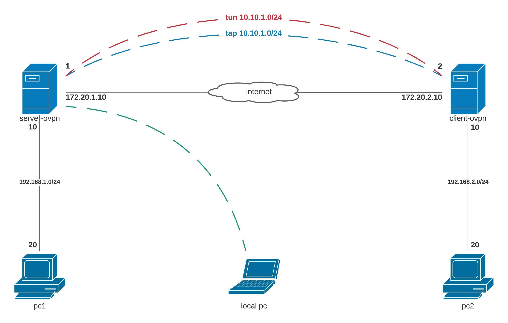

## Стенд для поднятие vpn.

Цель: VPN
1. Между двумя виртуалками поднять vpn в режимах
- tun
- tap
Прочуствовать разницу.

2. Поднять RAS на базе OpenVPN с клиентскими сертификатами, подключиться с локальной машины на виртуалку

### Реализация.

#### 1. Поднимим OpenVPN между между вертуалками


Настройка сетевого интерфейса на `PC1` и `PC2`
PC1:
```
[root@pc1 ~]# echo DEFROUTE="no" >> /etc/sysconfig/network-scripts/ifcfg-eth0 && systemctl restart network
[root@pc1 ~]# echo GATEWAY=192.168.1.1 >> /etc/sysconfig/network-scripts/ifcfg-eth1 && systemctl restart network
```
PC2:
```
[root@pc2 ~]# echo DEFROUTE="no" >> /etc/sysconfig/network-scripts/ifcfg-eth0 && systemctl restart network
[root@pc2 ~]# echo GATEWAY=192.168.2.1 >> /etc/sysconfig/network-scripts/ifcfg-eth1 && systemctl restart network
```
Установим необзодимые пакеты на `server-ovpn` и `client-ovpn`:

```
[root@server-ovpn ~]# yum install -y epel-release openvpn easy-rsa
[root@client-ovpn ~]# yum install -y epel-release openvpn
```
Включим forwarding пакетов между интерфейсами на `server-ovpn` и `client-ovpn`:

```
[root@server-ovpn ~]# echo net.ipv4.ip_forward = 1 >> /etc/sysctl.conf | sysctl -p
[root@client-ovpn ~]# echo net.ipv4.ip_forward = 1 >> /etc/sysctl.conf | sysctl -p
```
На сервере `server-ovpn` сгенерируем секретный ключ:
```
[root@server-ovpn ~]# mkdir -p /etc/openvpn/keys
[root@server-ovpn ~]# openvpn --genkey --secret /etc/openvpn/keys/ta.key
```
Сгенерирующий секретный ключ скопируем на сервер `client-ovpn` в созданный каталог `keys`.

Создадим конфигурационный файл (tap режим) на сервере `server-ovpn`:
```
[root@server-ovpn ~]# vi /etc/openvpn/server.conf

dev tap
ifconfig 10.10.1.1 255.255.255.0
topology subnet
route 192.168.2.0 255.255.255.0 10.10.1.2
secret /etc/openvpn/keys/ovpn.key
compress lzo
status /var/log/openvpn-status.log
log /var/log/openvpn.log
verb 3
```
Запускаем сервис и добавляем в автозагрузку:
```
[root@server-ovpn ~]# systemctl enable --now openvpn@server
```
Проверим статус сервиса `openvpn@server`:
```
[root@server-ovpn ~]# systemctl status openvpn@server
```

Создадим конфигурационный файл (tap режим) на сервере `client-ovpn`:
```
[root@client-ovpn ~]# vi /etc/openvpn/server.conf

dev tap
remote 172.20.1.10
ifconfig 10.10.1.2 255.255.255.0
topology subnet
route 192.168.1.0 255.255.255.0 10.10.1.1
secret /etc/openvpn/keys/ovpn.key
compress lzo
status /var/log/openvpn-status.log
log /var/log/openvpn.log
verb 3
```
Запускаем сервис и добавляем в автозагрузку:
```
[root@client-ovpn ~]# systemctl enable --now openvpn@server
```
Проверим статус сервиса `openvpn@server`:
```
[root@client-ovpn ~]# systemctl status openvpn@server
```

Протестируем созданный канал с помощью инструмента `iperf3`:
На машине `PC1` запустим утилиту `iperf3` в режиме сервер, а на `PC2` в режиме клиент:
```
[root@pc1 ~]# iperf3 -s
[root@pc2 ~]# iperf3 -c 192.168.1.2 -t 10 -i 5 -b 1000M -u
```
Результат тестирования показал:
```
[ ID] Interval           Transfer     Bandwidth       Jitter    Lost/Total Datagrams
[  4]   0.00-10.00  sec   496 MBytes   416 Mbits/sec  0.191 ms  345574/393431 (88%)
```
Изменим в конфигах /etc/openvpn/server.conf на сервере и клиенте режим с tap на tun.
Сново протестируем.
```
[ ID] Interval           Transfer     Bandwidth       Jitter    Lost/Total Datagrams
[  4]   0.00-10.00  sec   512 MBytes   429 Mbits/sec  0.233 ms  338531/393839 (86%)
```
Тестирование показало, что режим `tun` лучше по сравнению с `tap`. Так же есть разниза между ними, `tap` ведет себя как полноценный сетевой адапптер.

#### 2. Поднять RAS на базе OpenVPN с клиентскими сертификатами.

### Настройка Easy-RSA на сервере.

Скопируем набор скриптов из каталога `/usr/share/easy-rsa`, в /etc/openvpn/.
```
[root@server-ovpn ~]# mkdir -p /etc/openvpn/easy-rsa
[root@server-ovpn ~]# cp -rp /usr/share/easy-rsa/3.0.8/* /etc/openvpn/easy-rsa/
```

Создадим файл `vars` для генерации ключей и сертификатов:.
```
[root@server-ovpn ~]# vi /etc/openvpn/easy-rsa/vars
```
Содержимое файла:
```
set_var EASYRSA_REQ_COUNTRY    "RU"
set_var EASYRSA_REQ_PROVINCE   "Tula"
set_var EASYRSA_REQ_CITY       "Tula"
set_var EASYRSA_REQ_ORG        "My organisation"
set_var EASYRSA_REQ_EMAIL      "root@example.org"
set_var EASYRSA_REQ_OU         "IT department"
set_var EASYRSA_KEY_SIZE       2048
set_var EASYRSA_ALGO           rsa
set_var EASYRSA_CA_EXPIRE      3650
set_var EASYRSA_CERT_EXPIRE    3650
```
Перейдем в каталог `/etc/openvpn` и инициализируем каталог PKI:
```
[root@server-ovpn openvpn]# ./easy-rsa/easyrsa init-pki
```

Генерируем сертификат CA:
```
[root@server-ovpn openvpn]# ./easy-rsa/easyrsa build-ca nopass
```

Генирируем сертификат для сервера:
```
[root@server-ovpn openvpn]# ./easy-rsa/easyrsa gen-req vpnserver nopass
```

Подпишим сертификат для сервира:
```
[root@server-ovpn openvpn]# ./easy-rsa/easyrsa sign-req server vpnserver
```

Генерируем ключи Диффи-Хелмана:
```
[root@server-ovpn openvpn]# ./easy-rsa/easyrsa gen-dh
```


Генирируем 2 сертификата для клиентов `superuser` и `user`:
```
[root@server-ovpn openvpn]# ./easy-rsa/easyrsa gen-req superuser nopass
[root@server-ovpn openvpn]# ./easy-rsa/easyrsa gen-req user nopass
```

Подпишим сертификаты для клиентов:
```
[root@server-ovpn openvpn]# ./easy-rsa/easyrsa sign-req client superuser
[root@server-ovpn openvpn]# ./easy-rsa/easyrsa sign-req client user
```

Сгенерируем список отозванных сертификатов:
```
[root@server-ovpn openvpn]# ./easy-rsa/easyrsa gen-crl
```
Переместим все нужные файлы в каталог `keys`
```
[root@server-ovpn openvpn]# cp ./pki/ca.crt ./keys
[root@server-ovpn openvpn]# cp ./pki/issued/vpnserver.crt ./keys
[root@server-ovpn openvpn]# cp ./pki/private/vpnserver.key ./keys
[root@server-ovpn openvpn]# cp ./pki/dh.pem ./keys
```

Конфигурационный файл сервера:
```
[root@server-ovpn openvpn]# vi server.conf

port 1194
proto udp
dev tun

ca /etc/openvpn/easy-rsa/keys/ca.crt
cert /etc/openvpn/easy-rsa/keys/vpnserver.crt
key /etc/openvpn/easy-rsa/keys/vpnserver.key
dh /etc/openvpn/easy-rsa/keys/dh.pem
tls-auth keys/ta.key 0
crl-verify /etc/openvpn/easy-rsa/pki/crl.pem

server 10.10.1.0 255.255.255.0
ifconfig-pool-persist ipp.txt
push "route 192.168.1.0 255.255.255.0"
#push "dhcp-option DNS 172.16.10.1"
#push "dhcp-option DOMAIN example.org"
topology subnet

client-to-client

client-config-dir client

keepalive 10 120
comp-lzo
max-clients 10

persist-key
persist-tun

status /var/log/openvpn-status.log
log /var/log/openvpn.log
verb 3
```
Перезагрузим сервис OpenVPN
```
[root@server-ovpn openvpn]# systemctl restart openvpn@server
```

Создадим запись для пользователя `superuser`
```
[root@server-ovpn openvpn]# vi ./client/superuser

ifconfig-push 10.10.1.100 10.10.1.1
push "redirect-gateway"
```


### Настройка OpenVPN клиента.


#### Проверка задания


Ссылка на дополнительную информацию
- [Как настроить openvpn на CentOS](https://serveradmin.ru/nastroyka-openvpn-na-centos/)

https://www.dmosk.ru/instruktions.php?object=openvpn-ubuntu-install

https://howitmake.ru/blog/ubuntu/192.html
