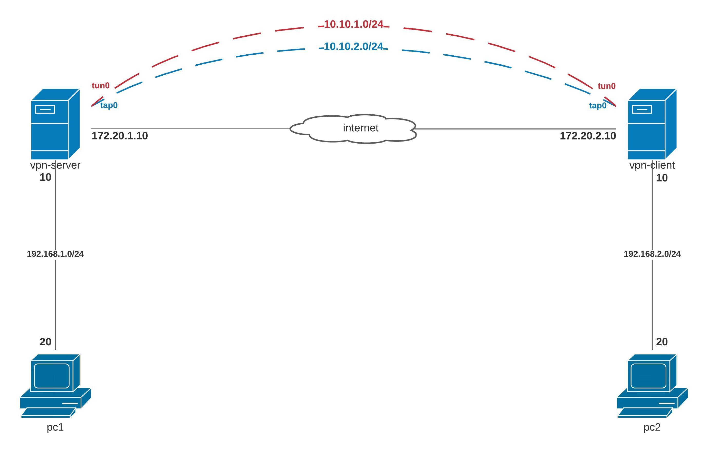

## Стенд для поднятие OpenVPN между между вертуалками.



### Реализация.

Настройка сетевого интерфейса на `PC1` и `PC2`
```
PC1:

[root@pc1 ~]# echo DEFROUTE="no" >> /etc/sysconfig/network-scripts/ifcfg-eth0 && systemctl restart network
[root@pc1 ~]# echo GATEWAY=192.168.1.10 >> /etc/sysconfig/network-scripts/ifcfg-eth1 && systemctl restart network
```
```
PC2:

[root@pc2 ~]# echo DEFROUTE="no" >> /etc/sysconfig/network-scripts/ifcfg-eth0 && systemctl restart network
[root@pc2 ~]# echo GATEWAY=192.168.2.10 >> /etc/sysconfig/network-scripts/ifcfg-eth1 && systemctl restart network
```

Установим пакеты на `server-ovpn` и `client-ovpn`:

```
[root@server-ovpn ~]# yum install -y epel-release openvpn easy-rsa
[root@client-ovpn ~]# yum install -y epel-release openvpn
```
Включим forwarding, пересылка пакетов между интерфейсами на `server-ovpn` и `client-ovpn`:

```
[root@server-ovpn ~]# echo net.ipv4.ip_forward = 1 >> /etc/sysctl.conf | sysctl -p
[root@client-ovpn ~]# echo net.ipv4.ip_forward = 1 >> /etc/sysctl.conf | sysctl -p
```
### Server-ovpn

Сгенерируем секретный ключ:
```
[root@server-ovpn ~]# mkdir -p /etc/openvpn/keys
[root@server-ovpn ~]# openvpn --genkey --secret /etc/openvpn/keys/ta.key
```

Сгенерирующий секретный ключ скопируем на сервер `client-ovpn` в созданный каталог `keys`.

Создадим конфигурационный файл (tap режим) на сервере `server-ovpn`:
```
[root@server-ovpn ~]# vi /etc/openvpn/server.conf

dev tap
ifconfig 10.10.1.1 255.255.255.0
topology subnet
route 192.168.2.0 255.255.255.0 10.10.1.2
secret /etc/openvpn/keys/ta.key
compress lzo
status /var/log/openvpn-status.log
log /var/log/openvpn.log
verb 3
```

Запускаем сервис и добавляем в автозагрузку:
```
[root@server-ovpn ~]# systemctl enable --now openvpn@server
```

Проверим статус сервиса `openvpn@server`:
```
[root@server-ovpn ~]# systemctl status openvpn@server
```

Создадим конфигурационный файл (tap режим) на сервере `client-ovpn`:
```
[root@client-ovpn ~]# vi /etc/openvpn/server.conf

dev tap
remote 172.20.1.10
ifconfig 10.10.1.2 255.255.255.0
topology subnet
route 192.168.1.0 255.255.255.0 10.10.1.1
secret /etc/openvpn/keys/ovpn.key
compress lzo
status /var/log/openvpn-status.log
log /var/log/openvpn.log
verb 3
```

Запускаем сервис и добавляем в автозагрузку:
```
[root@client-ovpn ~]# systemctl enable --now openvpn@server
```

Проверим статус сервиса `openvpn@server`:
```
[root@client-ovpn ~]# systemctl status openvpn@server
```

Протестируем созданный канал с помощью инструмента `iperf3`:
На машине `PC1` запустим утилиту `iperf3` в режиме сервер, а на `PC2` в режиме клиент:
```
[root@pc1 ~]# iperf3 -s
[root@pc2 ~]# iperf3 -c 192.168.1.2 -t 10 -i 5 -b 1000M -u
```
Результат тестирования показал:
```
[ ID] Interval           Transfer     Bandwidth       Jitter    Lost/Total Datagrams
[  4]   0.00-10.00  sec   496 MBytes   416 Mbits/sec  0.191 ms  345574/393431 (88%)
```

Изменим в конфигах /etc/openvpn/server.conf на сервере и клиенте режим с tap на tun.
Сново протестируем.
```
[ ID] Interval           Transfer     Bandwidth       Jitter    Lost/Total Datagrams
[  4]   0.00-10.00  sec   512 MBytes   429 Mbits/sec  0.233 ms  338531/393839 (86%)
```

Тестирование показало, что режим `tun` лучше по сравнению с `tap`. Так же есть разниза между ними, `tap` ведет себя как полноценный сетевой адапптер.

Проверка задания
----------------

1. Выполнить `vagrant up`, и автоматически поднимает Server и Client с установленным VPN соединением (через tun).


Ссылка на дополнительную информацию
- [Как настроить openvpn на CentOS](https://serveradmin.ru/nastroyka-openvpn-na-centos/)

https://www.dmosk.ru/instruktions.php?object=openvpn-ubuntu-install

https://howitmake.ru/blog/ubuntu/192.html
