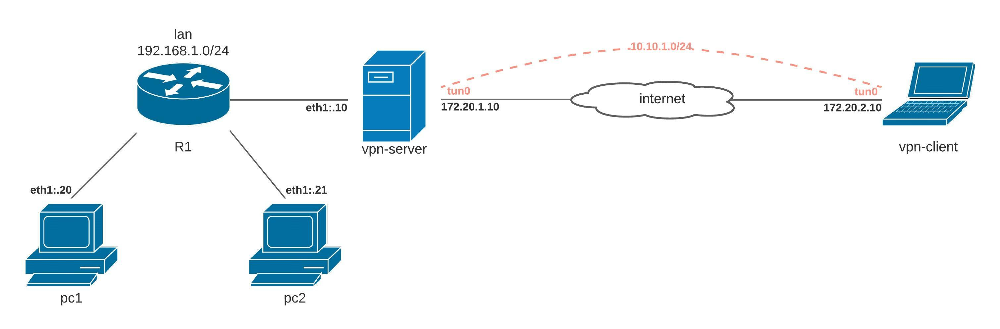

## Стенд для поднятие OpenVPN между между вертуалками.

### Реализация.

### Server-ovpn

Ссылка на дополнительную информацию
- [Как настроить openvpn на CentOS](https://serveradmin.ru/nastroyka-openvpn-na-centos/)

https://www.dmosk.ru/instruktions.php?object=openvpn-ubuntu-install

https://howitmake.ru/blog/ubuntu/192.html
