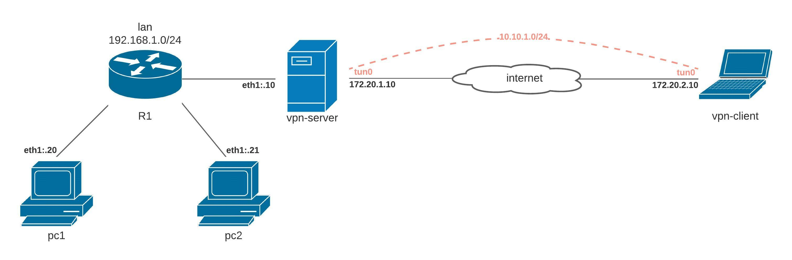

## Стенд для поднятие RAS на базе OpenVPN с клиенскими сертификатами.



### Реализация.

### OpenVPN server

Установим пакеты
```
[root@vpn-server ~]# yum install -y epel-release
[root@vpn-server ~]# yum install -y openvpn easy-rsa
```

Включим forwarding, пересылка пакетов между интерфейсами
```
[root@vpn-server ~]# echo net.ipv4.ip_forward = 1 >> /etc/sysctl.conf | sysctl -p
```

#### Сертификаты

Настроим центр сертификации на базе Easy-RSA на `server-ovpn`, скопируем скрипты easy-rsa в каталог `/etc/openvpn/easy-rsa/`:
```
[root@vpn-server ~]# mkdir -p /etc/openvpn/easy-rsa
[root@vpn-server ~]# cp -r /usr/share/easy-rsa/3.0.8/* /etc/openvpn/easy-rsa
```

Создадим шаблон для создпния сертификата.
```
[root@vpn-server ~]# cd /etc/openvpn/easy-rsa
[root@vpn-server easy-rsa]# vi vars

export KEY_COUNTRY="RU"
export KEY_PROVINCE="Tula"
export KEY_CITY="Tula"
export KEY_ORG="My organisation"
export KEY_EMAIL="root@example.org"
export KEY_CN="IT department"
export EASYRSA_KEY_SIZE=2048
export EASYRSA_ALGO=rsa
export EASYRSA_CA_EXPIRE=3650
export EASYRSA_CERT_EXPIRE=3650
```

Применим:
```
[root@vpn-server easy-rsa]# . ./vars
```

Инициализируем PKI:
```
[root@vpn-server easy-rsa]# ./easyrsa init-pki
```

Генерируем корневой сертификат, создаем удостоверяющий центр CA:
```
[root@vpn-server easy-rsa]# ./easyrsa build-ca nopass
```

Создаем ключ Диффи-Хеллмана:
```
[root@vpn-server easy-rsa]# ./easyrsa gen-dh
```

Сгенерируем секретный ключ:
```
[root@vpn-server easy-rsa]# openvpn --genkey --secret /etc/openvpn/server/ta.key
```

Генирируем сертификат (vpnserver) для сервера:
```
[root@vpn-server easy-rsa]# ./easyrsa gen-req vpnserver nopass
```

Подпишим сертификат (vpnserver) для сервира:
```
[root@vpn-server easy-rsa]# ./easyrsa sign-req server vpnserver

Type the word 'yes' to continue, or any other input to abort.
  Confirm request details: yes
```
Подтверим правильность `yes`

Сгенерируем список отозвонных сертивикатов:
```
[root@vpn-server easy-rsa]# ./easyrsa gen-crl
```

Заблокировать выданный сертификат (для примера user):
```
[root@vpn-server easy-rsa]# ./easyrsa revoke user
```

#### Настройки OpenVPN

Создадим каталог для индивидуальных настроек и логов:
```
[root@vpn-server easy-rsa]# mkdir -p /etc/openvpn/server/ccd && mkdir -p /var/log/openvpn
```

Копируем все неоюходимые для работы openvpn сервера файлы:
```
[root@vpn-server easy-rsa]# cp pki/issued/vpnserver.crt /etc/openvpn/server/
[root@vpn-server easy-rsa]# cp pki/private/vpnserver.key /etc/openvpn/server/
[root@vpn-server easy-rsa]# cp pki/dh.pem /etc/openvpn/server/
[root@vpn-server easy-rsa]# cp pki/ca.crt /etc/openvpn/server/
[root@vpn-server easy-rsa]# cp pki/crl.pem /etc/openvpn/server/
```

Создадим конфигурационный файл сервера:
```
[root@vpn-server easy-rsa]# vi /etc/openvpn/server/server.conf

#
# OpenVPN Server Config
#

port 1194
proto udp
dev tun

ca ca.crt
cert vpnserver.crt
key vpnserver.key
dh dh.pem
crl-verify crl.pem
tls-auth ta.key 0

cipher AES-256-CBC

server 10.10.1.0 255.255.255.0
ifconfig-pool-persist ipp.txt
push "route 192.168.1.0 255.255.255.0"

client-to-client
client-config-dir ccd

keepalive 10 120
comp-lzo
max-clients 10

persist-key
persist-tun

status /var/log/openvpn/openvpn-status.log
log /var/log/openvpn.log
verb 3

mode server
daemon
```

Запускаем сервис и добавляем в автозагрузку:
```
[root@vpn-server easy-rsa]# systemctl enable --now openvpn-server@server
```

Проверим статус сервиса `openvpn-server@server`:
```
[root@vpn-server easy-rsa]# systemctl status openvpn-server@server
```

#### Создадим пользователя для OpenVPN

Генирируем сертификат (vpnclien) для пользователя:
```
[root@vpn-server easy-rsa]# ./easyrsa gen-req vpnclient nopass
```

Подпишим сертификат (vpnclien) для пользователя:
```
[root@vpn-server easy-rsa]# ./easyrsa sign-req client vpnclient

Type the word 'yes' to continue, or any other input to abort.
  Confirm request details: yes
```

Подтверим правильность `yes`

### OpenVPN client

Установим пакеты
```
[root@vpn-client ~]# yum install -y epel-release
[root@vpn-client ~]# yum install -y openvpn
```

Включим forwarding, пересылка пакетов между интерфейсами
```
[root@vpn-client ~]# echo net.ipv4.ip_forward = 1 >> /etc/sysctl.conf | sysctl -p
```

#### Сертификаты

Скопируем нужные сертификаты (`ca.crt`,`vpnclient.crt`,`vpnclient.key`,`ta.key`) с `vpn-server` сервера на `vpn-client` клиент сервер.

Создадим конфигурационный файл клиент сервера:
```
[root@vpn-client easy-rsa]# vi /etc/openvpn/client/server.conf

#
# OpenVPN Client Config
#

client
proto udp
dev tun

remote 172.20.1.10 1194

ca ca.crt
cert vpnclient.crt
key vpnclient.key
tls-auth ta.key 1

cipher AES-256-CBC

tls-client
remote-cert-tls server

auth-nocache

keepalive 10 120
comp-lzo

persist-key
persist-tun

resolv-retry infinite

nobind

verb 0
mute 20
```

Запускаем сервис и добавляем в автозагрузку:
```
[root@vpn-client easy-rsa]# systemctl enable --now openvpn-client@server
```

Проверим статус сервиса `openvpn-client@server`:
```
[root@vpn-client easy-rsa]# systemctl status openvpn-client@server
```

Проверка задания
----------------

1. Выполнить `vagrant up`, и автоматически поднимет RAS на базе OpenVPN.

Ссылка на дополнительную информацию
- [Как настроить openvpn на CentOS](https://serveradmin.ru/nastroyka-openvpn-na-centos/)
